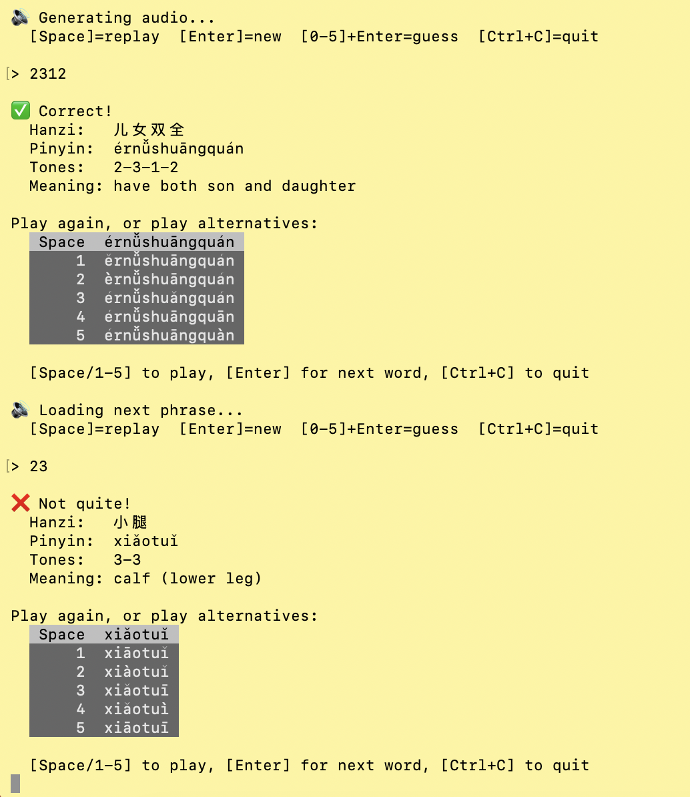

# Setting-up

1. Init a python environment
2. Run `bash install.sh`
3. Run `python start.py`
4. When you run for the first time, the script will download Qwen3-TTS weights from hugginface (2.4GB), which may take a while

# Overview

The goal is to guess a tones of a Mandarin phrase by listening to its pronounciation. You can press [Space] to repeat the pronounciation, with 5 different options provided. You can guess by pressing 11+[Enter] or 320+[Enter], etc. After you have guessed, you will have an option to listen to alternative tones:

